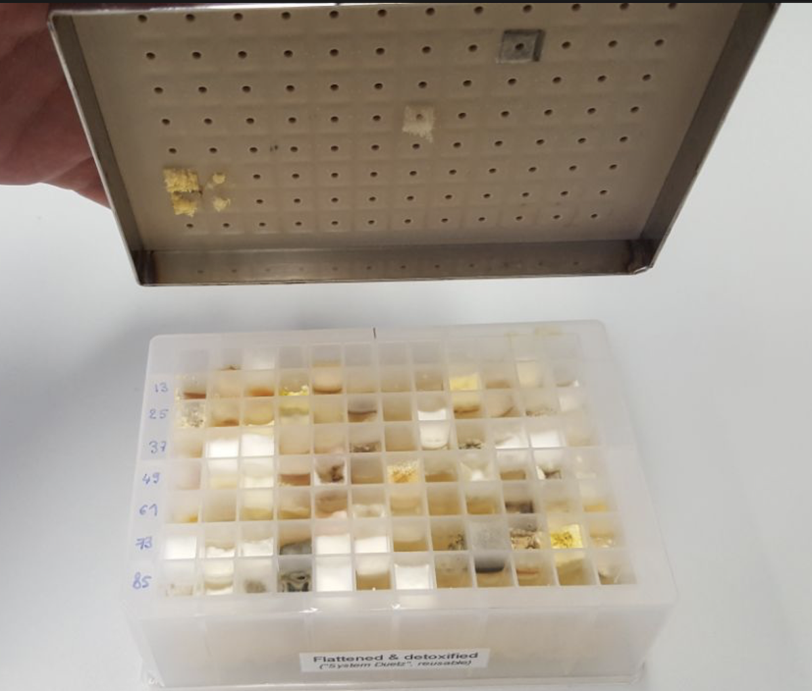
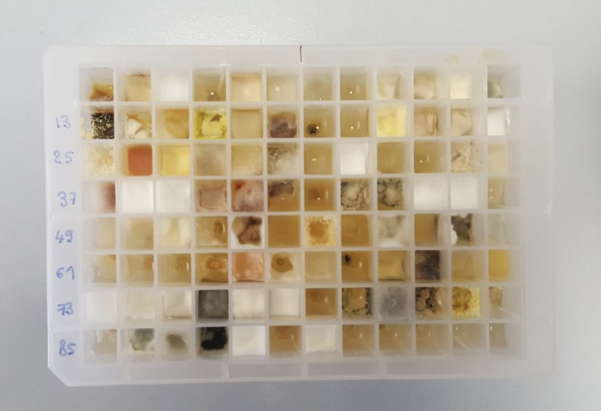
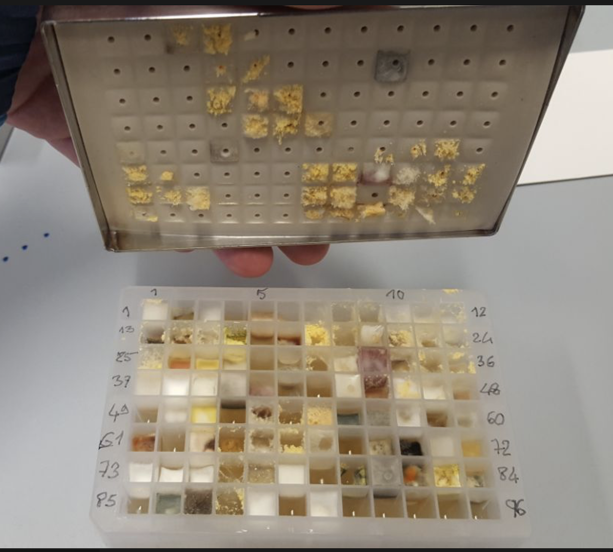
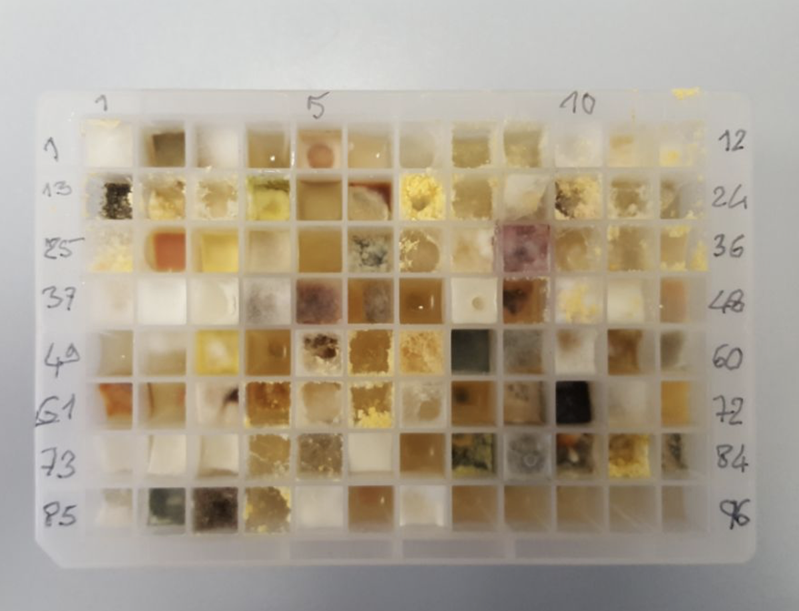
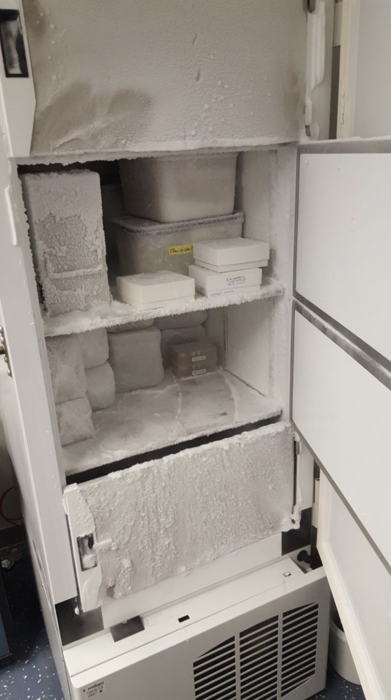

# Mycoscope project

Draft a chemical map of the fungal collection of Agroscope Changins (Mycoscope)

## 2021-01-06 14:33

2 96 well plates were brought back from ACW.

They were plated with aluminium foil and kept in the -80 C in CMU Geneva

